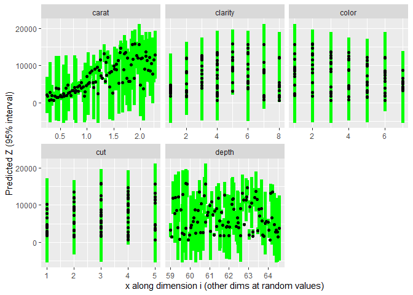
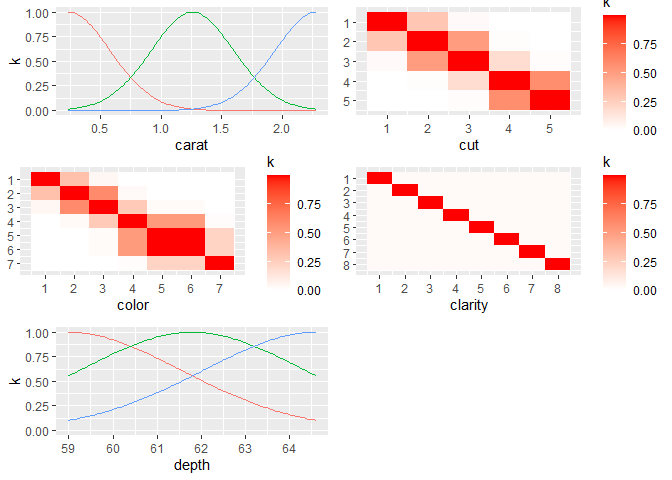
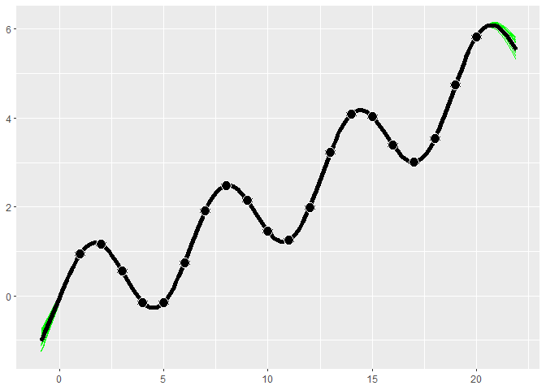
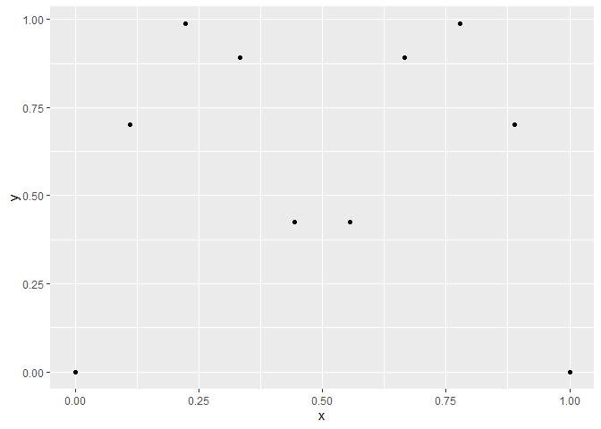
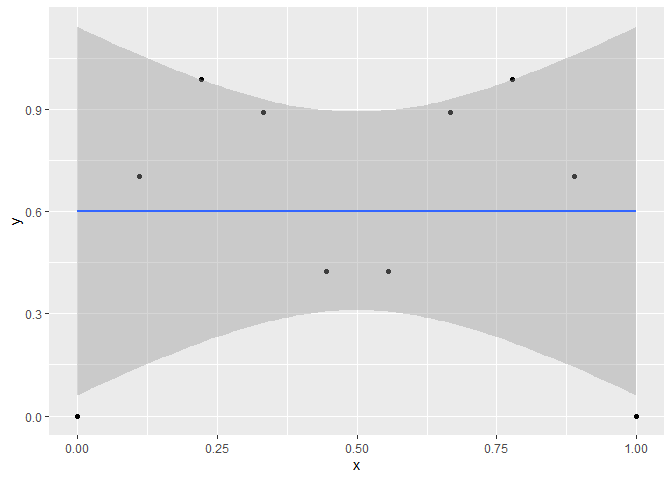
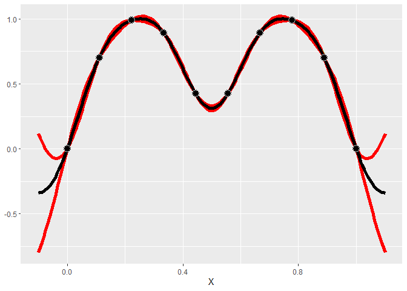
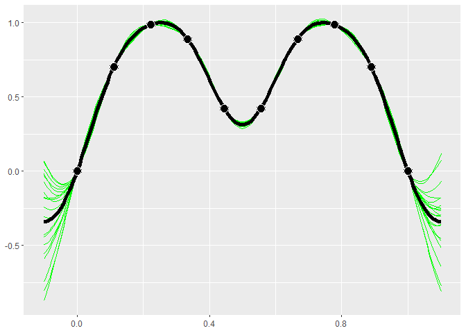
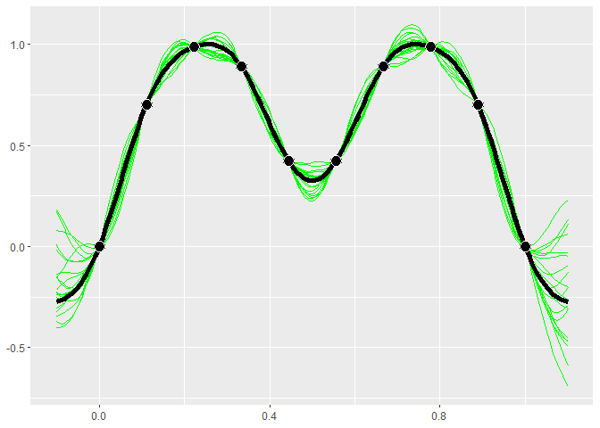
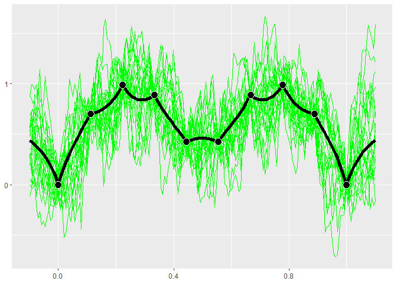
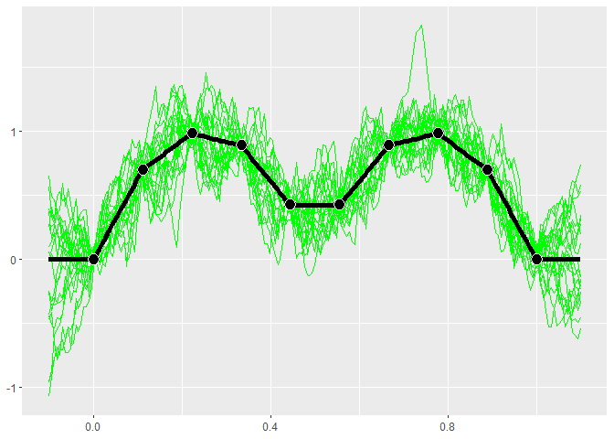

README
================

- [GauPro](#gaupro)
  - [Overview](#overview)
  - [Installation](#installation)
  - [Example in 1-Dimension](#example-in-1-dimension)
  - [Factor data: fitting the `diamonds`
    dataset](#factor-data-fitting-the-diamonds-dataset)
    - [Constructing a kernel](#constructing-a-kernel)
  - [Using kernels](#using-kernels)
  - [Combining kernels](#combining-kernels)
  - [Intro to GPs](#intro-to-gps)
    - [Using kernels](#using-kernels-1)
    - [Trends](#trends)

<!-- README.md is generated from README.Rmd. Please edit that file -->

# GauPro

<!-- badges: start -->

[](https://cran.r-project.org/package=GauPro)
[](https://app.codecov.io/gh/CollinErickson/GauPro)
[](https://github.com/CollinErickson/GauPro/actions)
[](https://github.com/CollinErickson/GauPro/actions/workflows/R-CMD-check.yaml)
[](https://r-pkg.org/pkg/GauPro)
[](https://cran.r-project.org/web/checks/check_results_GauPro.html)
<!-- badges: end -->

## Overview

This package allows you to fit a Gaussian process regression model to a
dataset. A Gaussian process (GP) is a commonly used model in computer
simulation. It assumes that the distribution of any set of points is
multivariate normal. A major benefit of GP models is that they provide
uncertainty estimates along with their predictions.

## Installation

You can install like any other package through CRAN.

    install.packages('GauPro')

The most up-to-date version can be downloaded from my Github account.

    # install.packages("devtools")
    devtools::install_github("CollinErickson/GauPro")

## Example in 1-Dimension

This simple shows how to fit the Gaussian process regression model to
data. The function `gpkm` creates a Gaussian process kernel model fit to
the given data.

``` r
library(GauPro)
#> Loading required package: mixopt
#> Loading required package: dplyr
#> 
#> Attaching package: 'dplyr'
#> The following objects are masked from 'package:stats':
#> 
#>     filter, lag
#> The following objects are masked from 'package:base':
#> 
#>     intersect, setdiff, setequal, union
#> Loading required package: ggplot2
#> Loading required package: splitfngr
#> Loading required package: numDeriv
#> Loading required package: rmarkdown
#> Loading required package: tidyr
```

``` r
n <- 12
x <- seq(0, 1, length.out = n)
y <- sin(6*x^.8) + rnorm(n,0,1e-1)
gp <- gpkm(x, y)
#> * Argument 'kernel' is missing. It has been set to 'matern52'. See documentation for more details.
```

Plotting the model helps us understand how accurate the model is and how
much uncertainty it has in its predictions. The green and red lines are
the 95% intervals for the mean and for samples, respectively.

``` r
gp$plot1D()
```

<!-- -->

## Factor data: fitting the `diamonds` dataset

The model fit using `gpkm` can also be used with data/formula input and
can properly handle factor data.

In this example, the `diamonds` data set is fit by specifying the
formula and passing a data frame with the appropriate columns.

``` r
library(ggplot2)
diamonds_subset <- diamonds[sample(1:nrow(diamonds), 60), ]
dm <- gpkm(price ~ carat + cut + color + clarity + depth,
           diamonds_subset)
#> * Argument 'kernel' is missing. It has been set to 'matern52'. See documentation for more details.
```

Calling `summary` on the model gives details about the model, including
diagnostics about the model fit and the relative importance of the
features.

``` r
summary(dm)
#> Formula:
#>   price ~ carat + cut + color + clarity + depth 
#> 
#> Residuals:
#>     Min.  1st Qu.   Median     Mean  3rd Qu.     Max. 
#> -6589.09  -217.68    37.85  -165.28   181.42  1619.37 
#> 
#> Feature importance:
#>   carat     cut   color clarity   depth 
#>  1.5497  0.2130  0.3275  0.3358  0.0003 
#> 
#> AIC: 1008.96 
#> 
#> Pseudo leave-one-out R-squared       :   0.901367 
#> Pseudo leave-one-out R-squared (adj.):   0.8427204 
#> 
#> Leave-one-out coverage on 60 samples (small p-value implies bad fit):
#>  68%:     0.7        p-value:   0.7839 
#>  95%:    0.95        p-value:   1
```

We can also plot the model to get a visual idea of how each input
affects the output.

``` r
plot(dm)
```

<!-- -->

### Constructing a kernel

In this case, the kernel was chosen automatically by looking at which
dimensions were continuous and which were discrete, and then using a
Matern 5/2 on the continuous dimensions (1,5), and separate ordered
factor kernels on the other dimensions since those columns in the data
frame are all ordinal factors. We can construct our own kernel using
products and sums of any kernels, making sure that the continuous
kernels ignore the factor dimensions.

Suppose we want to construct a kernel for this example that uses the
power exponential kernel for the two continuous dimensions, ordered
kernels on `cut` and `color`, and a Gower kernel on `clarity`. First we
construct the power exponential kernel that ignores the 3 factor
dimensions. Then we construct

``` r
cts_kernel <- k_IgnoreIndsKernel(k=k_PowerExp(D=2), ignoreinds = c(2,3,4))
factor_kernel2 <- k_OrderedFactorKernel(D=5, xindex=2, nlevels=nlevels(diamonds_subset[[2]]))
factor_kernel3 <- k_OrderedFactorKernel(D=5, xindex=3, nlevels=nlevels(diamonds_subset[[3]]))
factor_kernel4 <- k_GowerFactorKernel(D=5, xindex=4, nlevels=nlevels(diamonds_subset[[4]]))

# Multiply them
diamond_kernel <- cts_kernel * factor_kernel2 * factor_kernel3 * factor_kernel4
```

Now we can pass this kernel into `gpkm` and it will use it.

``` r
dm <- gpkm(price ~ carat + cut + color + clarity + depth,
           diamonds_subset, kernel=diamond_kernel)
dm$plotkernel()
```

<!-- -->

## Using kernels

A key modeling decision for Gaussian process models is the choice of
kernel. The kernel determines the covariance and the behavior of the
model. The default kernel is the Matern 5/2 kernel (`Matern52`), and is
a good choice for most cases. The Gaussian, or squared exponential,
kernel (`Gaussian`) is a common choice but often leads to a bad fit
since it assumes the process the data comes from is infinitely
differentiable. Other common choices that are available include the
`Exponential`, Matern 3/2 (`Matern32`), Power Exponential (`PowerExp`),
`Cubic`, Rational Quadratic (`RatQuad`), and Triangle (`Triangle`).

These kernels only work on numeric data. For factor data, the kernel
will default to a Latent Factor Kernel (`LatentFactorKernel`) for
character and unordered factors, or an Ordered Factor Kernel
(`OrderedFactorKernel`) for ordered factors. As long as the input is
given in as a data frame and the columns have the proper types, then the
default kernel will properly handle it by applying the numeric kernel to
the numeric inputs and the factor kernel to the factor and character
inputs.

Kernels are stored as R6 objects. They can all be created using the R6
object generator (e.g., `Matern52$new()`), or using the
`k_<kernel name>` shortcut function (e.g., `k_Matern52()`). The latter
is easier to use (and recommended) since R will show the function
arguments and autocomplete.

The following table shows details on all the kernels available.

| Kernel                | Function                | Continuous/<br />discrete | Equation                                                                               | Notes                                                                                                                                                                                                                                                                       |
|-----------------------|-------------------------|---------------------------|----------------------------------------------------------------------------------------|-----------------------------------------------------------------------------------------------------------------------------------------------------------------------------------------------------------------------------------------------------------------------------|
| Gaussian              | `k_Gaussian`            | cts                       |                                                                                        | Often causes issues since it assumes infinite differentiability. Experts don’t recommend using it.                                                                                                                                                                          |
| Matern 3/2            | `k_Matern32`            | cts                       |                                                                                        | Assumes one time differentiability. This is often too low of an assumption.                                                                                                                                                                                                 |
| Matern 5/2            | `k_Matern52`            | cts                       |                                                                                        | Assumes two time differentiability. Generally the best.                                                                                                                                                                                                                     |
| Exponential           | `k_Exponential`         | cts                       |                                                                                        | Equivalent to Matern 1/2. Assumes no differentiability.                                                                                                                                                                                                                     |
| Triangle              | `k_Triangle`            | cts                       |                                                                                        |                                                                                                                                                                                                                                                                             |
| Power exponential     | `k_PowerExp`            | cts                       |                                                                                        |                                                                                                                                                                                                                                                                             |
| Periodic              | `k_Periodic`            | cts                       | $k(x, y) = \sigma^2 * \exp(-\sum(\alpha_i*sin(p * (x_i-y_i))^2))$                      | The only kernel that takes advantage of periodic data. But there is often incoherence far apart, so you will likely want to multiply by one of the standard kernels.                                                                                                        |
| Cubic                 | `k_Cubic`               | cts                       |                                                                                        |                                                                                                                                                                                                                                                                             |
| Rational quadratic    | `k_RatQuad`             | cts                       |                                                                                        |                                                                                                                                                                                                                                                                             |
| Latent factor kernel  | `k_LatentFactorKernel`  | factor                    |                                                                                        | This embeds each discrete value into a low dimensional space and calculates the distances in that space. This works well when there are many discrete values.                                                                                                               |
| Ordered factor kernel | `k_OrderedFactorKernel` | factor                    |                                                                                        | This maintains the order of the discrete values. E.g., if there are 3 levels, it will ensure that 1 and 2 have a higher correlation than 1 and 3. This is similar to embedding into a latent space with 1 dimension and requiring the values to be kept in numerical order. |
| Factor kernel         | `k_FactorKernel`        | factor                    |                                                                                        | This fits a parameter for every pair of possible values. E.g., if there are 4 discrete values, it will fit 6 (4 choose 2) values. This doesn’t scale well. When there are many discrete values, use any of the other factor kernels.                                        |
| Gower factor kernel   | `k_GowerFactorKernel`   | factor                    | $k(x,y) = \begin{cases} 1,  & \text{if } x=y \\ p, & \text{if } x \neq y  \end{cases}$ | This is a very simple factor kernel. For the relevant dimension, the correlation will either be 1 if the value are the same, or $p$ if they are different.                                                                                                                  |
| Ignore indices        | `k_IgnoreIndsKernel`    | N/A                       |                                                                                        | Use this to create a kernel that ignores certain dimensions. Useful when you want to fit different kernel types to different dimensions or when there is a mix of continuous and discrete dimensions.                                                                       |

Factor kernels: note that these all only work on a single dimension. If
there are multiple factor dimensions in your input, then they each will
be given a different factor kernel.

## Combining kernels

Kernels can be combined by multiplying or adding them directly.

The following example uses the product of a periodic and a Matern 5/2
kernel to fit periodic data.

``` r
x <- 1:20
y <- sin(x) + .1*x^1.3
combo_kernel <- k_Periodic(D=1) * k_Matern52(D=1)
gp <- gpkm(x, y, kernel=combo_kernel, nug.min=1e-6)
#> * nug is at minimum value after optimizing. Check the fit to see it this caused a bad fit. Consider changing nug.min. This is probably fine for noiseless data.
gp$plot()
```

<!-- -->

For an example of a more complex kernel being constructed, see the
diamonds section above.

## Intro to GPs

*(This section used to be the main vignette on CRAN for this package.)*

This R package provides R code for fitting Gaussian process models to
data. The code is created using the `R6` class structure, which is why
`$` is used to access object methods.

A Gaussian process fits a model to a dataset, which gives a function
that gives a prediction for the mean at any point along with a variance
of this prediction.

Suppose we have the data below

``` r
x <- seq(0,1,l=10)
y <- abs(sin(2*pi*x))^.8
ggplot(aes(x,y), data=cbind(x,y)) +
  geom_point()
```

<!-- -->

A linear model (LM) will fit a straight line through the data and
clearly does not describe the underlying function producing the data.

``` r
ggplot(aes(x,y), data=cbind(x,y)) +
    geom_point() +
    stat_smooth(method='lm')
#> `geom_smooth()` using formula = 'y ~ x'
```

<!-- -->

A Gaussian process is a type of model that assumes that the distribution
of points follows a multivariate distribution.

In GauPro, we can fit a GP model with Gaussian correlation function
using the function `gpkm`.

``` r
library(GauPro)
gp <- gpkm(x, y, kernel=k_Gaussian(D=1), parallel=FALSE)
```

Now we can plot the predictions given by the model. Shown below, this
model looks much better than a linear model.

``` r
gp$plot1D()
```

<!-- -->

A very useful property of GP’s is that they give a predicted error. The
red lines give an approximate 95% confidence interval for the value at
each point (measure value, not the mean). The width of the prediction
interval is largest between points and goes to zero near data points,
which is what we would hope for.

GP models give distributions for the predictions. Realizations from
these distributions give an idea of what the true function may look
like. Calling `$cool1Dplot()` on the 1-D gp object shows 20
realizations. The realizations are most different away from the design
points.

``` r
if (requireNamespace("MASS", quietly = TRUE)) {
  gp$cool1Dplot()
}
```

<!-- -->

### Using kernels

The kernel, or covariance function, has a large effect on the Gaussian
process being estimated. Many different kernels are available in the
`gpkm()` function which creates the GP object.

The example below shows what the Matern 5/2 kernel gives.

``` r
kern <- k_Matern52(D=1)
gpk <- gpkm(matrix(x, ncol=1), y, kernel=kern, parallel=FALSE)
if (requireNamespace("MASS", quietly = TRUE)) {
  plot(gpk)
}
```

<!-- -->

The exponential kernel is shown below. You can see that it has a huge
effect on the model fit. The exponential kernel assumes the correlation
between points dies off very quickly, so there is much more uncertainty
and variation in the predictions and sample paths.

``` r
kern.exp <- k_Exponential(D=1)
gpk.exp <- gpkm(matrix(x, ncol=1), y, kernel=kern.exp, parallel=FALSE)
if (requireNamespace("MASS", quietly = TRUE)) {
  plot(gpk.exp)
}
```

<!-- -->

### Trends

Along with the kernel the trend can also be set. The trend determines
what the mean of a point is without any information from the other
points. I call it a trend instead of mean because I refer to the
posterior mean as the mean, whereas the trend is the mean of the normal
distribution. Currently the three options are to have a mean 0, a
constant mean (default and recommended), or a linear model.

With the exponential kernel above we see some regression to the mean.
Between points the prediction reverts towards the mean of 0.2986876.
Also far away from any data the prediction will near this value.

Below when we use a mean of 0 we do not see this same reversion.

``` r
kern.exp <- k_Exponential(D=1)
trend.0 <- trend_0$new()
gpk.exp <- gpkm(matrix(x, ncol=1), y, kernel=kern.exp, trend=trend.0, parallel=FALSE)
if (requireNamespace("MASS", quietly = TRUE)) {
  plot(gpk.exp)
}
```

<!-- -->
