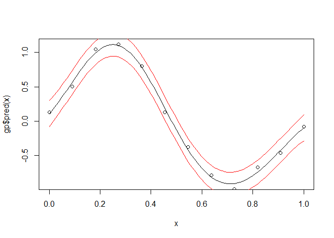
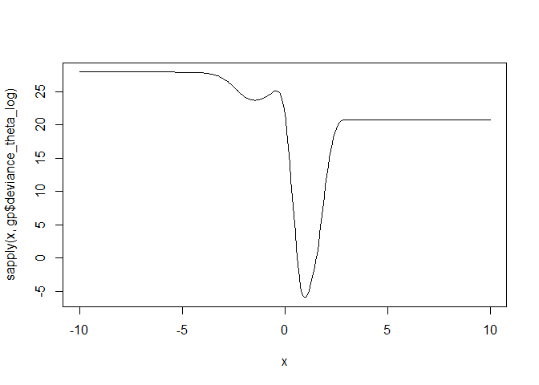
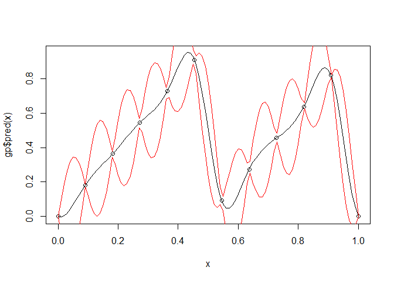
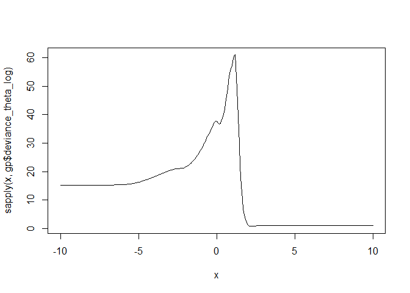

<!-- README.md is generated from README.Rmd. Please edit that file -->
GauPro
======

[](https://travis-ci.org/CollinErickson/GauPro) [](http://cran.r-project.org/package=GauPro) [](https://codecov.io/gh/CollinErickson/GauPro)

This package allows you to fit a Gaussian process to a dataset. A Gaussian process is a commonly used model in computer simulation. It assumes that the distribution of any set of points is multivariate normal with a constant mean and a correlation function.

This package only fits a simple GP model and only works with the Gaussian correlation function.

You should probably use a different package for your modeling, such as laGP, mlegp, or GPfit if you are using R, or GPy if you are using Python.

Examples in 1-Dimension
-----------------------

Fit a sine curve with noise.

``` r
n <- 12
x <- matrix(seq(0,1,length.out = n), ncol=1)
y <- sin(2*pi*x) + rnorm(n,0,1e-1)
gp <- GauPro::GauPro(X=x, Z=y)
curve(gp$pred(x));points(x,y)
curve(gp$pred(x)+2*gp$pred(x,T)$se,col=2,add=T);curve(gp$pred(x)-2*gp$pred(x,T)$se,col=2,add=T)
```



This is the likelihood as a function of the log of theta. It is not convex and is difficult to optimize in general.

``` r
curve(sapply(x, gp$deviance_theta_log),-10,10, n = 300) # deviance profile
```



Fit a sawtooth function with no noise.

``` r
n <- 12
x <- matrix(seq(0,1,length.out = n), ncol=1)
y <- (2*x) %%1
gp <- GauPro::GauPro(X=x, Z=y)
curve(gp$pred(x));points(x,y)
curve(gp$pred(x)+2*gp$pred(x,T)$se,col=2,add=T);curve(gp$pred(x)-2*gp$pred(x,T)$se,col=2,add=T)
```



``` r
curve(sapply(x, gp$deviance_theta_log),-10,10, n = 300) # deviance profile
```


