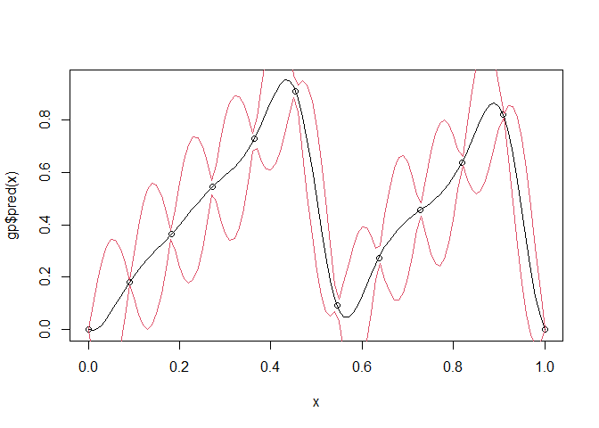
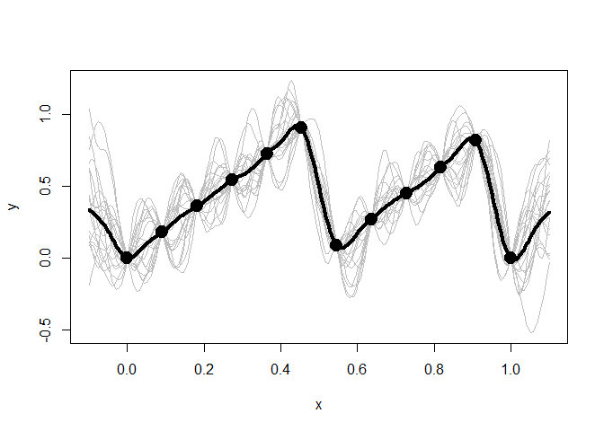
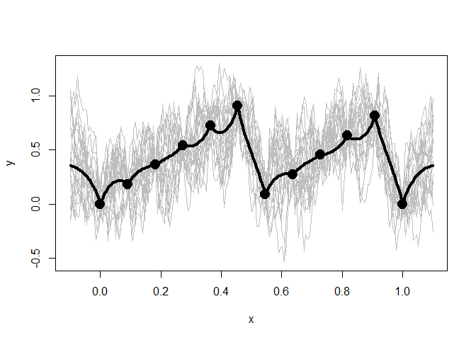
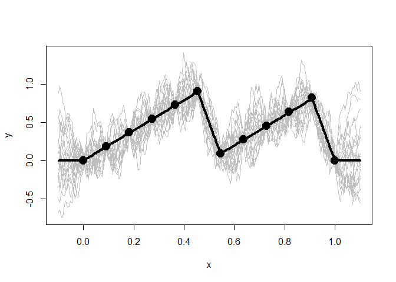

<!-- README.md is generated from README.Rmd. Please edit that file -->

# GauPro

[](https://travis-ci.org/CollinErickson/GauPro)
[](https://cran.r-project.org/package=GauPro)
[](https://codecov.io/gh/CollinErickson/GauPro)

## Overview

This package allows you to fit a Gaussian process to a dataset. A
Gaussian process is a commonly used model in computer simulation. It
assumes that the distribution of any set of points is multivariate
normal with a constant mean and a correlation function.

The newest release allows you to use different kernel and trend
functions, instead of just a squared exponential covariance.

You should probably use a different package for your modeling, such as
laGP, mlegp, or GPfit if you are using R, or GPy if you are using
Python.

## Installation

You can install like any other package

    install.packages('GauPro')

The most up-to-date version can be downloaded from my Github account.

    # install.packages("devtools")
    devtools::install_github("CollinErickson/GauPro")

## Examples in 1-Dimension

Fit a sine curve with noise.

``` r
n <- 12
x <- matrix(seq(0,1,length.out = n), ncol=1)
y <- sin(2*pi*x) + rnorm(n,0,1e-1)
gp <- GauPro::GauPro(X=x, Z=y)
curve(gp$pred(x));points(x,y)
curve(gp$pred(x)+2*gp$pred(x,T)$se,col=2,add=T);curve(gp$pred(x)-2*gp$pred(x,T)$se,col=2,add=T)
```

<!-- -->

This is the likelihood as a function of the log of theta. It is not
convex and is difficult to optimize in
general.

``` r
curve(sapply(x, gp$deviance_theta_log),-10,10, n = 300) # deviance profile
```

<!-- -->

Fit a sawtooth function with no noise.

``` r
n <- 12
x <- matrix(seq(0,1,length.out = n), ncol=1)
y <- (2*x) %%1
gp <- GauPro::GauPro(X=x, Z=y)
curve(gp$pred(x));points(x,y)
curve(gp$pred(x)+2*gp$pred(x,T)$se,col=2,add=T);curve(gp$pred(x)-2*gp$pred(x,T)$se,col=2,add=T)
```

<!-- -->

``` r
curve(sapply(x, gp$deviance_theta_log),-10,10, n = 300) # deviance profile
```

<!-- -->

## Using kernels

``` r
library(GauPro)
```

The kernel, or covariance function, has a large effect on the Gaussian
process being estimated. The function `GauPro` uses the squared
exponential, or Gaussian, covariance function. The newer version of
GauPro has a new function that will fit a model using whichever kernel
is specified.

To do this a kernel must be specified, then passed to
`GauPro_kernel_model$new`. The example below shows what the Matern 5/2
kernel gives.

``` r
kern <- Matern52$new(0)
gpk <- GauPro_kernel_model$new(matrix(x, ncol=1), y, kernel=kern, parallel=FALSE)
if (requireNamespace("MASS", quietly = TRUE)) {
  plot(gpk)
}
```

<!-- -->

The exponential kernel is shown below. You can see that it has a huge
effect on the model fit. The exponential kernel assumes the correlation
between points dies off very quickly, so there is much more uncertainty
and variation in the predictions and sample paths.

``` r
kern.exp <- Exponential$new(0)
gpk.exp <- GauPro_kernel_model$new(matrix(x, ncol=1), y, kernel=kern.exp, parallel=FALSE)
if (requireNamespace("MASS", quietly = TRUE)) {
  plot(gpk.exp)
}
```

<!-- -->

### Trends

Along with the kernel the trend can also be set. The trend determines
what the mean of a point is without any information from the other
points. I call it a trend instead of mean because I refer to the
posterior mean as the mean, whereas the trend is the mean of the normal
distribution. Currently the three options are to have a mean 0, a
constant mean (default and recommended), or a linear model.

With the exponential kernel above we see some regression to the mean.
Between points the prediction reverts towards the mean of 0.4006891.
Also far away from any data the prediction will near this value.

Below when we use a mean of 0 we do not see this same reversion.

``` r
kern.exp <- Exponential$new(0)
trend.0 <- trend_0$new()
gpk.exp <- GauPro_kernel_model$new(matrix(x, ncol=1), y, kernel=kern.exp, trend=trend.0, parallel=FALSE)
if (requireNamespace("MASS", quietly = TRUE)) {
  plot(gpk.exp)
}
```

<!-- -->
