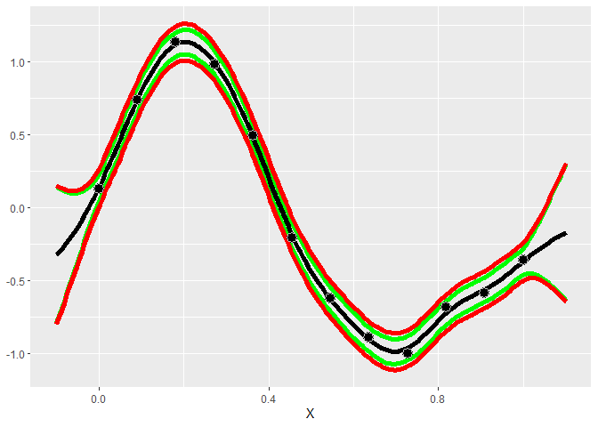
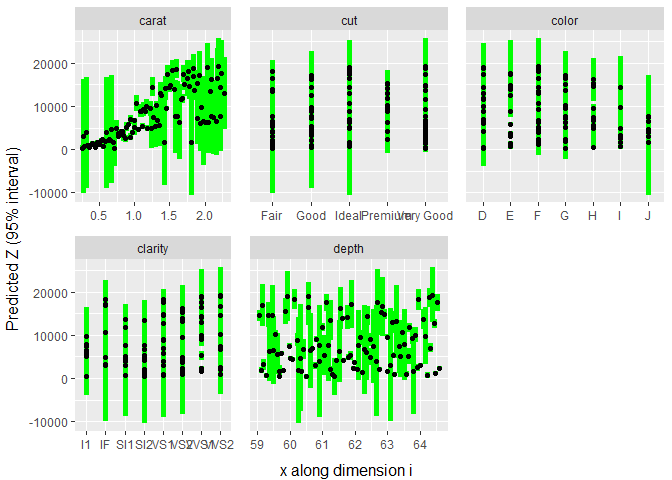

<!-- README.md is generated from README.Rmd. Please edit that file -->

# GauPro

<!-- badges: start -->

[](https://cran.r-project.org/package=GauPro)
[](https://app.codecov.io/gh/CollinErickson/GauPro)
[](https://github.com/CollinErickson/GauPro/actions)
[](https://github.com/CollinErickson/GauPro/actions/workflows/R-CMD-check.yaml)
[](https://r-pkg.org/pkg/GauPro)
<!-- badges: end -->

## Overview

This package allows you to fit a Gaussian process regression model to a
dataset. A Gaussian process (GP) is a commonly used model in computer
simulation. It assumes that the distribution of any set of points is
multivariate normal. A major benefit of GP models is that they provide
uncertainty estimates along with their predictions.

## Installation

You can install like any other package through CRAN.

    install.packages('GauPro')

The most up-to-date version can be downloaded from my Github account.

    # install.packages("devtools")
    devtools::install_github("CollinErickson/GauPro")

## Example in 1-Dimension

This simple shows how to fit the Gaussian process regression model to
data.

``` r
library(GauPro)
```

``` r
n <- 12
x <- seq(0, 1, length.out = n)
y <- sin(6*x^.8) + rnorm(n,0,1e-1)
gp <- gpkm(x, y)
#> Argument 'kernel' is missing. It has been set to 'matern52'. See documentation for more details.
```

Plotting the model helps us understand how accurate the model is and how
much uncertainty it has in its predictions. The green and red lines are
the 95% intervals for the mean and for samples, respectively.

``` r
gp$plot1D()
```

<!-- -->

## Factor data: fitting the `diamonds` dataset

The model fit using `gpkm` can also be used with data/formula input and
can properly handle factor data.

In this example, the `diamonds` data set is fit by specifying the
formula and passing a data frame with the appropriate columns.

``` r
library(ggplot2)
diamonds_subset <- diamonds[sample(1:nrow(diamonds), 60), ]
dm <- gpkm(price ~ carat + cut + color + clarity + depth,
           diamonds_subset)
#> Argument 'kernel' is missing. It has been set to 'matern52'. See documentation for more details.
```

Calling `summary` on the model gives details about the model, including
diagnostics about the model fit and the relative importance of the
features.

``` r
summary(dm)
#> Formula:
#>   price ~ carat + cut + color + clarity + depth 
#> 
#> Residuals:
#>     Min.  1st Qu.   Median     Mean  3rd Qu.     Max. 
#> -6589.09  -217.68    37.85  -165.28   181.42  1619.37 
#> 
#> Feature importance:
#>   carat     cut   color clarity   depth 
#>  1.5497  0.2130  0.3275  0.3358  0.0003 
#> 
#> AIC: 1008.96 
#> 
#> Pseudo leave-one-out R-squared       :   0.901367 
#> Pseudo leave-one-out R-squared (adj.):   0.8427204 
#> 
#> Leave-one-out coverage on 60 samples (small p-value implies bad fit):
#>  68%:     0.7        p-value:   0.7839 
#>  95%:    0.95        p-value:   1
```

We can also plot the model to get a visual idea of how each input
affects the output.

``` r
plot(dm)
```

<!-- -->

## Using kernels

A key modeling decision for Gaussian process models is the choice of
kernel. The kernel determines the covariance and the behavior of the
model. The default kernel is the Matern 5/2 kernel (`Matern52`), and is
a good choice for most cases. The Gaussian, or squared exponential,
kernel (`Gaussian`) is a common choice but often leads to a bad fit
since it assumes the process the data comes from is infinitely
differentiable. Other common choices that are available include the
`Exponential`, Matern 3/2 (`Matern32`), Power Exponential (`PowerExp`),
`Cubic`, Rational Quadratic (`RatQuad`), and Triangle (`Triangle`).

These kernels only work on numeric data. For factor data, the kernel
will default to a Latent Factor Kernel (`LatentFactorKernel`) for
character and unordered factors, or an Ordered Factor Kernel
(`OrderedFactorKernel`) for ordered factors. As long as the input is
given in as a data frame and the columns have the proper types, then the
default kernel will properly handle it by applying the numeric kernel to
the numeric inputs and the factor kernel to the factor and character
inputs.
